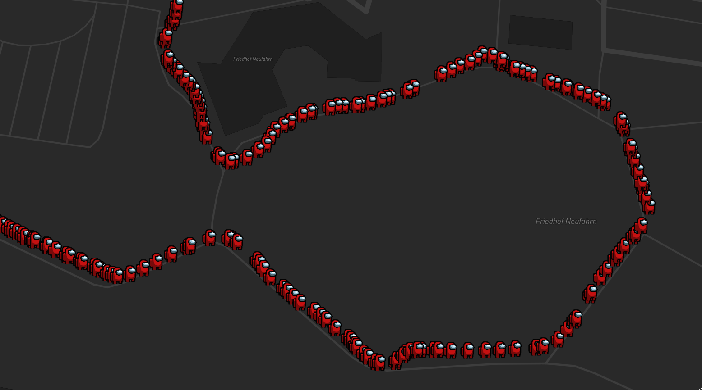

# expo-next-kafka
> Real-time location streaming with React Native, Next.js and Apache Kafka


## Setup

### Upstash Kafka

- [Sign up for Upstash](https://console.upstash.com/login)
- Create a new Kafka cluster
- Copy `KAFKA_URL` and `KAFKA_TOKEN`

### Mapbox

- [Sign up for Mapbox](https://account.mapbox.com/auth/signup/)
- Create a new Mapbox Token
- Copy `MAPBOX_TOKEN`

### Develop locally

```bash
git clone https://github.com/paulphys/expo-next-kafka.git
cd expo-next-kafka
pnpm
pnpm dev
```

Fill in the Upstash Kafka credentials in `mobile/.env` and `web/src/components/Map.tsx`

> **Warning**
> This exposes the credentials to the client, only for demo purposes
